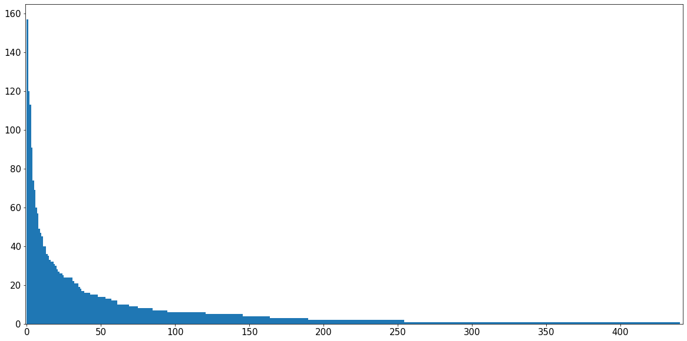
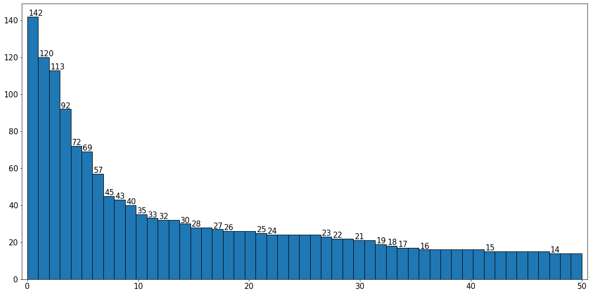
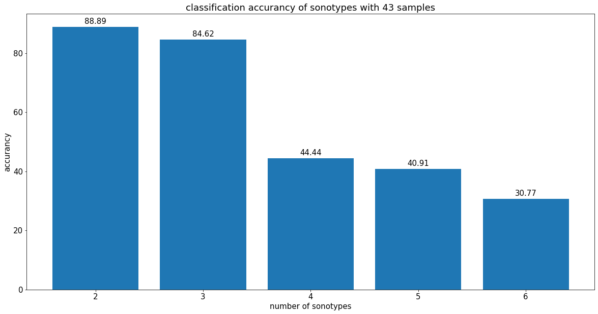
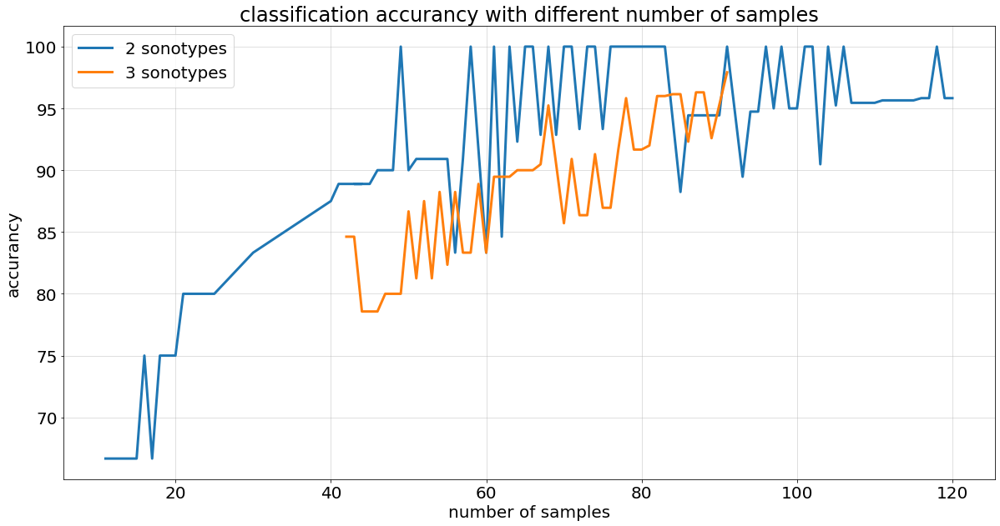
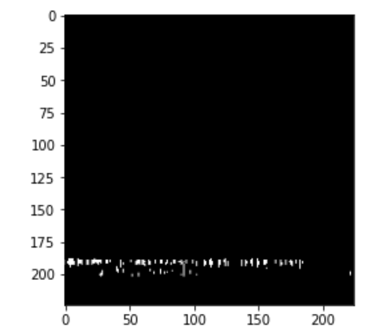
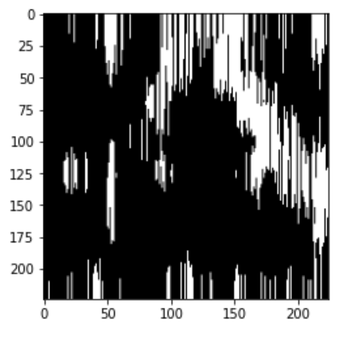

# Notes

## Links to Google Colab files

viewable jupyter notebook on google drive with UW-Madison account

Classification: https://colab.research.google.com/drive/1mUK81IBL4Dz1X76jQjlJbFwwMPGUxReP?usp=sharing

Dataset creation: https://colab.research.google.com/drive/1h7tLkUp5yOKkKi2C4Kb4VR_VSStb8Fx8?usp=sharing

Plot the data in experiment: https://colab.research.google.com/drive/1ZNYUKgbTARTiLv7_ywiiN4Us5PJxBbiQ?usp=sharing

## Histogram of data

Uploaded on May 27th.

Whole histogram:

Top 50 data:

Top 150 frequency: 142 120 113  92  72  69  57  45  43  40  35  33  32  32  30  28  28  27  26  26  26  25  24  24  24  24  24  23  22  22  21  21  19  18  17  17  16  16  16  16  16  16  15  15  15  15  15  15  14  14  14  14  14  14  13  13  13  12  12  12  12  12  11  10  10  10  10  10  10  10  10  10   9   9   9   9   9   9   9   9   8   8   8   8   8   7   7   7   7   7   7   7   7   7   6   6   6   6   6   6

## Data

Tested with sonotypes with highest k number of data

 10*np.log10(Sxx). Not work

### 43 data for different number of classes

52, 138, 463, 86, 139, 220

| Classes | validation number | Accuracy |
| :------ | ----------------- | -------- |
| 2       | 9                 | 88.89    |
| 3       | 13                | 76.92    |
| 4       | 18                | 44.44    |
| 5       | 22                | 40.91    |
| 6       | 28                | 30.77    |

3 loss: 0.4509 - accuracy: 0.7759 - val_loss: 0.9303 - val_accuracy: 0.7692
4 loss: 1.0052 - accuracy: 0.5649 - val_loss: 1.4301 - val_accuracy: 0.4444
5 loss: 0.3115 - accuracy: 0.8860 - val_loss: 3.6770 - val_accuracy: 0.4091

### Thresholding, normalization

Tested with only birds
Sonotypes (order or decreasing number): 52, 138, 463, 86, 139, 220
normalization with ((cur_spec - s_min)/(s_max - s_min) * 255)

| Types | number of data/each | Thresholding (70-90) | Normalization, * 255 | Normalization | w/o both |
| :---- | ------------------- | -------------------- | -------------------- | ------------- | -------- |
| 2     | 120                 | 95.83                | 100                  | 95.83         | 62.50    |
| 3     | 91                  | 95.83                | 97.92                | 95.83         | 40.00    |
| 4     | 57                  | 60.87                | 60.87                | 54.35         |          |
| 5     | 45                  | 43.48                | 43.38                |               |          |
| 6     | 43                  | 26.92                | 30.77                |               |          |

Normalization, *255
2: loss: 0.0011 - accuracy: 1.0000 - val_loss: 0.0211 - val_accuracy: 1.0000
3: oss: 0.0150 - accuracy: 0.9948 - val_loss: 0.0819 - val_accuracy: 0.9792
4: loss: 0.0842 - accuracy: 0.9805 - val_loss: 4.4760 - val_accuracy: 0.6087
5: loss: 0.3897 - accuracy: 0.8713 - val_loss: 3.1227 - val_accuracy: 0.4348
6: loss: 2.4047 - accuracy: 0.2802 - val_loss: 1.9193 - val_accuracy: 0.3077

Normalization, no *255
2: loss: 0.0013 - accuracy: 1.0000 - val_loss: 0.0809 - val_accuracy: 0.9583
3: loss: 0.0709 - accuracy: 0.9844 - val_loss: 0.1802 - val_accuracy: 0.9583
4: loss: 0.2645 - accuracy: 0.9011 - val_loss: 3.5054 - val_accuracy: 0.5435

### Experiment

52 & 86, overlap in frequency range, able to classify with 57 data
loss: 0.0341 - accuracy: 0.9890 - val_loss: 0.0302 - val_accuracy: 1.0000

 **To know how many samples are needed**

Pick the 3 classes (52,138,463) that have high accuracy (92%). Say that these classes have 92 samples. Do tests decreasing the sample size: 92,91,90,....and plot how the accuracy (Y-axis) changes with sample size (X-axis). This will allow us to know how many samples are needed

Need to repeat for many times till get the random data good enough to reach the high accuracy starting from 80 data
Repeat: model is easy to overfit the training data. The val_loss goes high after a few epoches.

#### 3 classes, 52, 138, 463

28 data for validation
91 loss: 0.0150 - accuracy: 0.9948 - val_loss: 0.0819 - val_accuracy: 0.9792

27 for validation
90 loss: 0.0516 - accuracy: 0.9918 - val_loss: 0.2503 - val_accuracy: 0.9529
89 loss: 0.0641 - accuracy: 0.9708 - val_loss: 0.3682 - val_accuracy: 0.9259
88 loloss: 0.0093 - accuracy: 1.0000 - val_loss: 0.2222 - val_accuracy: 0.9630
87 loss: 0.0154 - accuracy: 0.9957 - val_loss: 0.4732 - val_accuracy: 0.9630

26 for validation
86 loss: 0.1802 - accuracy: 0.9353 - val_loss: 0.2362 - val_accuracy: 0.9231
85 loss: 0.0873 - accuracy: 0.9782 - val_loss: 0.1352 - val_accuracy: 0.9615
84 loss: 0.1341 - accuracy: 0.9558 - val_loss: 0.2886 - val_accuracy: 0.9615

25 for validation
83 loss: 31.4726 - accuracy: 0.8616 - val_loss: 1.6562 - val_accuracy: 0.9600
82 loss: 32.5113 - accuracy: 0.9616 - val_loss: 3.1294 - val_accuracy: 0.9600
81  loss: 74.6881 - accuracy: 0.8211 - val_loss: 397.4071 - val_accuracy: 0.9200

24 for validation
80 loss: 140.2473 - accuracy: 0.6991 - val_loss: 39.7443 - val_accuracy: 0.8333
79 loss: 0.0894 - accuracy: 0.9718 - val_loss: 0.9891 - val_accuracy: 0.8333
78 loss: 0.0892 - accuracy: 0.9619 - val_loss: 0.3288 - val_accuracy: 0.9583
77 loss: 25.5467 - accuracy: 0.9324 - val_loss: 16.5913 - val_accuracy: 0.9167

23 for validation
76 loss: 8.3883 - accuracy: 0.9707 - val_loss: 91.9992 - val_accuracy: 0.8696
75 loss: 3.9293 - accuracy: 0.9752 - val_loss: 7.3834 - val_accuracy: 0.8696
74 loss: 21.2090 - accuracy: 0.9296 - val_loss: 23.0440 - val_accuracy: 0.9130

22 for validation
73 loss: 15.3687 - accuracy: 0.9594 - val_loss: 133.4415 - val_accuracy: 0.8636
72 loss: 19.4985 - accuracy: 0.9227 - val_loss: 13.9987 - val_accuracy: 0.8636
71 loss: 3.9067 - accuracy: 0.9581 - val_loss: 57.5173 - val_accuracy: 0.9091

21 for validation
70 loss: 3.9066 - accuracy: 0.9683 - val_loss: 22.7109 - val_accuracy: 0.8571
69 loss: 3.9034 - accuracy: 0.9892 - val_loss: 32.5230 - val_accuracy: 0.9048
68 loss: 7.0706 - accuracy: 0.9727 - val_loss: 77.9176 - val_accuracy: 0.9524
67 loss: 24.7759 - accuracy: 0.9333 - val_loss: 79.8080 - val_accuracy: 0.9048

20 for validation
66 loss: 9.9766 - accuracy: 0.9551 - val_loss: 12.9988 - val_accuracy: 0.9000
65 loss: 46.5290 - accuracy: 0.8914 - val_loss: 17.8715 - val_accuracy: 0.9000
64 loss: 8.5313 - accuracy: 0.9593 - val_loss: 46.5058 - val_accuracy: 0.9000

19 for validation
63 loss: 6.8372 - accuracy: 0.9706 - val_loss: 38.7598 - val_accuracy: 0.8947
62 loss: 6.5576 - accuracy: 0.9641 - val_loss: 6.5716 - val_accuracy: 0.8947
61 loss: 12.3140 - accuracy: 0.9390 - val_loss: 30.0597 - val_accuracy: 0.8947

18 for validation
60 loss: 17.2051 - accuracy: 0.9568 - val_loss: 49.0847 - val_accuracy: 0.8333
59 loss: 6.6145 - accuracy: 0.9560 - val_loss: 14.3925 - val_accuracy: 0.8889
58 loss: 13.2819 - accuracy: 0.9679 - val_loss: 90.0838 - val_accuracy: 0.8333
57 loss: 27.7378 - accuracy: 0.9346 - val_loss: 94.7842 - val_accuracy: 0.8333

17 for validation
56 loss: 16.4154 - accuracy: 0.9735 - val_loss: 72.0173 - val_accuracy: 0.8824
55 loss: 9.4331 - accuracy: 0.9662 - val_loss: 169.8662 - val_accuracy: 0.8235
54 loss: 1.1435 - accuracy: 0.9862 - val_loss: 10.7798 - val_accuracy: 0.8824

16 for validation:
53 loss: 37.3004 - accuracy: 0.9091 - val_loss: 136.6697 - val_accuracy: 0.8125
52 loss: 6.8258 - accuracy: 0.9714 - val_loss: 16.6585 - val_accuracy: 0.8750
51 loss: 6.7812 - accuracy: 0.9708 - val_loss: 44.0388 - val_accuracy: 0.8125

15 for validation:
50 loss: 23.2088 - accuracy: 0.9185 - val_loss: 110.8245 - val_accuracy: 0.8667
49 loss: 15.3196 - accuracy: 0.9167 - val_loss: 3.3225 - val_accuracy: 0.8000
48 loss: 36.4759 - accuracy: 0.9070 - val_loss: 110.8068 - val_accuracy: 0.8000
47 loss: 14.3803 - accuracy: 0.9365 - val_loss: 151.4827 - val_accuracy: 0.8000

14 for validation:
46 loss: 22.1991 - accuracy: 0.9113 - val_loss: 16.4814 - val_accuracy: 0.7857
loss: 20.9738 - accuracy: 0.9355 - val_loss: 24.9895 - val_accuracy: 0.9286
45 loss: 27.7414 - accuracy: 0.9339 - val_loss: 46.1671 - val_accuracy: 0.7857
44 loss: 64.6826 - accuracy: 0.7966 - val_loss: 92.1280 - val_accuracy: 0.7857

13 for validation:
43 loss: 51.2820 - accuracy: 0.9224 - val_loss: 49.5596 - val_accuracy: 0.8462
42 loss: 16.3885 - accuracy: 0.9381 - val_loss: 19.8637 - val_accuracy: 0.9231

#### 2 classes, 52 and 138

**Current resuls are not stable and change a lot with different randomly choose training & testing data.**

Test 30 more epoch when achieve a higher val_accuracy or the val_loss keeps decreasing.

24 data for validation
 120 loss: 10.2101 - accuracy: 0.9444 - val_loss: 24.5293 - val_accuracy: 0.9583
 119 loss: 0.0876 - accuracy: 0.9720 - val_loss: 0.1846 - val_accuracy: 0.9583 
 ? 118 loss: 0.2349 - accuracy: 0.8962 - val_loss: 0.1354 - val_accuracy: 1.0000
 117 loss: 0.0684 - accuracy: 0.9714 - val_loss: 0.0555 - val_accuracy: 0.9583
 116：loss: 0.0865 - accuracy: 0.9567 - val_loss: 0.1659 - val_accuracy: 0.9583

23 for validation
 115 loss: 0.0622 - accuracy: 0.9710 - val_loss: 0.1499 - val_accuracy: 0.9565
 114 loss: 0.0506 - accuracy: 0.9805 - val_loss: 0.0813 - val_accuracy: 0.9565
 113 loss: 0.1489 - accuracy: 0.9458 - val_loss: 0.1342 - val_accuracy: 0.9565
 112 loss: 0.2215 - accuracy: 0.9005 - val_loss: 0.1364 - val_accuracy: 0.9565
 111 loss: 0.2155 - accuracy: 0.9146 - val_loss: 0.1484 - val_accuracy: 0.9565

22 for validation
 110 loss: 0.0596 - accuracy: 0.9747 - val_loss: 0.1505 - val_accuracy: 0.9545
 109 loss: 0.0062 - accuracy: 1.0000 - val_loss: 0.4755 - val_accuracy: 0.9545
 108 loss: 0.0560 - accuracy: 0.9794 - val_loss: 0.1254 - val_accuracy: 0.9545
 107 loss: 0.1984 - accuracy: 0.9375 - val_loss: 0.1616 - val_accuracy: 0.9545
? 106 loss: 0.4557 - accuracy: 0.8000 - val_loss: 0.1157 - val_accuracy: 1.0000

21 for validation
 105 loss: 0.2643 - accuracy: 0.8889 - val_loss: 0.1754 - val_accuracy: 0.9524
 ? 104 loss: 0.1852 - accuracy: 0.9198 - val_loss: 0.0818 - val_accuracy: 1.0000
 ? 103 loss: 0.0052 - accuracy: 0.9946 - val_loss: 0.7802 - val_accuracy: 0.9048
 ? 102 loss: 0.1256 - accuracy: 0.9454 - val_loss: 0.0885 - val_accuracy: 1.0000
 ? 101 loss: 0.1781 - accuracy: 0.9392 - val_loss: 0.0856 - val_accuracy: 1.0000

20 for validation
 100 loss: 0.1467 - accuracy: 0.9167 - val_loss: 0.1682 - val_accuracy: 0.9500
 99 loss: 0.0915 - accuracy: 0.9775 - val_loss: 0.0882 - val_accuracy: 0.9500 
 ? 98 loss: 0.1314 - accuracy: 0.9489 - val_loss: 0.0041 - val_accuracy: 1.0000
 97 loss: 0.1194 - accuracy: 0.9598 - val_loss: 0.1157 - val_accuracy: 0.9500
 96 loss: 0.1053 - accuracy: 0.9593 - val_loss: 0.1174 - val_accuracy: 1.0000

19 for validation
 95 loss: 0.0690 - accuracy: 0.9766 - val_loss: 0.2759 - val_accuracy: 0.9474
 94 loss: 0.1198 - accuracy: 0.9527 - val_loss: 0.1854 - val_accuracy: 0.9474
 ? 93 loss: 0.0065 - accuracy: 1.0000 - val_loss: 0.5487 - val_accuracy: 0.8947
 92 loss: 0.0121 - accuracy: 1.0000 - val_loss: 0.1784 - val_accuracy: 0.9474
 ? 91 loss: 1.6359 - accuracy: 0.6319 - val_loss: 0.1319 - val_accuracy: 1.0000

18 for validation
 90 loss: 0.1568 - accuracy: 0.9259 - val_loss: 0.3638 - val_accuracy: 0.9444
 89 loss: 0.0125 - accuracy: 1.0000 - val_loss: 0.0809 - val_accuracy: 0.9444
 88 loss: 0.0034 - accuracy: 1.0000 - val_loss: 1.2489 - val_accuracy: 0.9444
 87 loss: 0.1081 - accuracy: 0.9615 - val_loss: 0.2537 - val_accuracy: 0.9444
 86 loss: 0.0296 - accuracy: 0.9870 - val_loss: 0.2580 - val_accuracy: 0.9444

17 for validation
 85 loss: 0.0104 - accuracy: 0.9935 - val_loss: 0.6370 - val_accuracy: 0.8824
 84 loss: 0.0610 - accuracy: 0.9868 - val_loss: 0.1102 - val_accuracy: 0.9412
 83  loss: 0.0635 - accuracy: 0.9799 - val_loss: 0.0733 - val_accuracy: 1.0000
 82 loss: 0.1019 - accuracy: 0.9592 - val_loss: 0.0449 - val_accuracy: 1.0000
 81 loss: 0.1142 - accuracy: 0.9448 - val_loss: 0.0574 - val_accuracy: 1.0000

16 for validation
 80 loss: 0.1003 - accuracy: 0.9722 - val_loss: 0.0562 - val_accuracy: 1.0000
 79 loss: 0.1161 - accuracy: 0.9437 - val_loss: 0.0366 - val_accuracy: 1.0000
 78 loss: 0.1797 - accuracy: 0.9000 - val_loss: 0.1145 - val_accuracy: 1.0000
 77 loss: 0.0676 - accuracy: 0.9786 - val_loss: 0.0480 - val_accuracy: 1.0000
 76 loss: 0.0362 - accuracy: 0.9926 - val_loss: 0.0229 - val_accuracy: 1.0000

15 for validation
75 loss: 0.0160 - accuracy: 1.0000 - val_loss: 0.4722 - val_accuracy: 0.9333
74 loss: 0.0838 - accuracy: 0.9624 - val_loss: 0.0524 - val_accuracy: 1.0000
73 loss: 0.1622 - accuracy: 0.9313 - val_loss: 0.0192 - val_accuracy: 1.0000
72 loss: 0.0124 - accuracy: 1.0000 - val_loss: 0.1856 - val_accuracy: 0.9333
71 loss: 0.1847 - accuracy: 0.9370 - val_loss: 0.0477 - val_accuracy: 1.0000

14 for validation
70  loss: 0.0039 - accuracy: 1.0000 - val_loss: 0.0432 - val_accuracy: 1.0000
69 loss: 0.1438 - accuracy: 0.9516 - val_loss: 0.4960 - val_accuracy: 0.9286
68 loss: 0.0075 - accuracy: 1.0000 - val_loss: 0.0083 - val_accuracy: 1.0000
67 loss: 0.0853 - accuracy: 0.9833 - val_loss: 0.1508 - val_accuracy: 0.9286
66 loss: 0.0548 - accuracy: 0.9831 - val_loss: 0.0609 - val_accuracy: 1.0000

13 for validation
65 loss: 0.0199 - accuracy: 1.0000 - val_loss: 0.9058 - val_accuracy: 0.7692
    loss: 0.0153 - accuracy: 1.0000 - val_loss: 0.0076 - val_accuracy: 1.0000 
64 loss: 0.0024 - accuracy: 1.0000 - val_loss: 0.5877 - val_accuracy: 0.9231
?63 loss: 0.0069 - accuracy: 1.0000 - val_loss: 0.0530 - val_accuracy: 1.0000 3 times with really low val_accuracy
62 loss: loss: 0.0086 - accuracy: 1.0000 - val_loss: 0.3886 - val_accuracy: 0.8462
61 loss: 0.0099 - accuracy: 1.0000 - val_loss: 1.2679 - val_accuracy: 0.6923

​	? loss: 0.0788 - accuracy: 0.9541 - val_loss: 0.0511 - val_accuracy: 1.0000

12 for validation
60 loss: 0.0189 - accuracy: 0.9907 - val_loss: 0.6076 - val_accuracy: 0.9167
59  loss: 0.0786 - accuracy: 0.9811 - val_loss: 0.6464 - val_accuracy: 0.8333
	loss: 0.1140 - accuracy: 0.9717 - val_loss: 0.7146 - val_accuracy: 0.9167
58 loss: 0.1258 - accuracy: 0.9615 - val_loss: 0.2798 - val_accuracy: 0.8333
	loss: 0.0465 - accuracy: 0.9808 - val_loss: 0.0873 - val_accuracy: 1.0000
57 loss: 0.1477 - accuracy: 0.9412 - val_loss: 1.0928 - val_accuracy: 0.7500
56 loss: 0.0567 - accuracy: 0.9800 - val_loss: 1.3478 - val_accuracy: 0.7500

11 for validation
55 loss: 0.1625 - accuracy: 0.9394 - val_loss: 0.9168 - val_accuracy: 0.7273
	loss: 0.2017 - accuracy: 0.9596 - val_loss: 0.3826 - val_accuracy: 0.9091
54 loss: 0.4416 - accuracy: 0.8454 - val_loss: 0.2656 - val_accuracy: 0.9091
? 53 x6 loss: 0.0260 - accuracy: 1.0000 - val_loss: 0.1036 - val_accuracy: 0.9091
52 x3 loss: 0.0330 - accuracy: 0.9892 - val_loss: 0.2469 - val_accuracy: 0.9091
51 loss: 0.2020 - accuracy: 0.9341 - val_loss: 2.4611 - val_accuracy: 0.2727
	 loss: 0.0212 - accuracy: 1.0000 - val_loss: 0.2233 - val_accuracy: 0.9091

10 for validation
50 loss: 0.1375 - accuracy: 0.9556 - val_loss: 2.1524 - val_accuracy: 0.6000
	loss: 0.0737 - accuracy: 0.9889 - val_loss: 0.2495 - val_accuracy: 0.9000
49 loss: 0.0017 - accuracy: 1.0000 - val_loss: 0.0520 - val_accuracy: 1.0000
48 x3 loss: 0.1620 - accuracy: 0.9535 - val_loss: 0.0731 - val_accuracy: 0.9000
47 x6 loss: 0.0783 - accuracy: 0.9643 - val_loss: 0.0168 - val_accuracy: 0.9000
46 x4 loss: 0.0252 - accuracy: 0.9878 - val_loss: 0.0351 - val_accuracy: 1.0000

9 for validation
45 x2 loss: 0.0146 - accuracy: 1.0000 - val_loss: 0.3190 - val_accuracy: 0.8889
44 x4 loss: 0.1394 - accuracy: 0.9367 - val_loss: 0.1448 - val_accuracy: 1.0000
43 x8 loss: 0.0038 - accuracy: 1.0000 - val_loss: 0.7115 - val_accuracy: 0.8889
		loss: 0.2686 - accuracy: 0.9221 - val_loss: 0.0881 - val_accuracy: 1.0000
44 loss: 0.0051 - accuracy: 1.0000 - val_loss: 0.0120 - val_accuracy: 0.8889
43 loss: 0.0468 - accuracy: 0.9733 - val_loss: 0.0954 - val_accuracy: 0.8889
42 x2 loss: 0.0325 - accuracy: 1.0000 - val_loss: 0.0720 - val_accuracy: 0.8889
41 loss: 0.0254 - accuracy: 0.9863 - val_loss: 0.0475 - val_accuracy: 0.8889

8 for validation
40 loss: 0.1569 - accuracy: 0.9722 - val_loss: 0.0523 - val_accuracy: 0.8750

6 for validation
30  loss: 0.1526 - accuracy: 0.9630 - val_loss: 0.1200 - val_accuracy: 0.8333

5 for validation
25 loss: 0.0954 - accuracy: 0.9556 - val_loss: 0.2874 - val_accuracy: 0.8000
24 loss: 0.0026 - accuracy: 1.0000 - val_loss: 1.5397 - val_accuracy: 0.8000
23 loss: 0.0059 - accuracy: 1.0000 - val_loss: 1.1524 - val_accuracy: 0.8000
22 x2 loss: 0.0156 - accuracy: 1.0000 - val_loss: 3.0134 - val_accuracy: 0.8000
21 loss: 0.0313 - accuracy: 1.0000 - val_loss: 1.7543 - val_accuracy: 0.6000
	loss: 0.0143 - accuracy: 1.0000 - val_loss: 0.7582 - val_accuracy: 0.8000

4 for validation
20 loss: 0.0258 - accuracy: 1.0000 - val_loss: 1.2608 - val_accuracy: 0.7500
19 loss: 0.0761 - accuracy: 0.9706 - val_loss: 0.2419 - val_accuracy: 0.7500
18 loss: 0.3738 - accuracy: 0.9375 - val_loss: 0.0142 - val_accuracy: 1.0000
17 loss: 0.0069 - accuracy: 1.0000 - val_loss: 0.0994 - val_accuracy: 1.0000
16 loss: 0.0022 - accuracy: 1.0000 - val_loss: 1.7084 - val_accuracy: 0.7500

3 for validation
15 loss: 0.0698 - accuracy: 0.9630 - val_loss: 0.7313 - val_accuracy: 0.6667
14 loss: 0.0113 - accuracy: 1.0000 - val_loss: 4.0116 - val_accuracy: 0.3333
	loss: 0.0452 - accuracy: 1.0000 - val_loss: 4.7361 - val_accuracy: 0.6667
	2 random choices with 0.3333 val_accuracy, 1 with 0.6667
13 loss: 0.0200 - accuracy: 1.0000 - val_loss: 0.8217 - val_accuracy: 0.6667
12 loss: 0.2686 - accuracy: 0.9221 - val_loss: 0.9951 - val_accuracy: 0.6667
11 loss: 0.1728 - accuracy: 0.9511 - val_loss: 0.7511 - val_accuracy: 0.6667

### Only birds

Sonotypes (order or decreasing number): 52, 138, 463, 86, 139, 220

| Types | number of data | Accuracy (%) |
| :---- | -------------- | ------------ |
| 2     | 120            | 95.83        |
| 3     | 91             | 92.86        |
| 4     | 57             | 60.87        |
| 5     | 45             | 43.48        |
| 6     | 43             | 26.92        |

2 types, 120 each

loss: 10.2101 - accuracy: 0.9444 - val_loss: 24.5293 - val_accuracy: 0.9583

3 types, 92 each

loss: 0.0228 - accuracy: 0.9879 - val_loss: 0.7307 - val_accuracy: 0.9286

4 types, 57 each

accuracy: 0.8683 - val_loss: 2.6672 - val_accuracy: 0.6087

5 types, 45 each

accuracy: 0.3713 - val_loss: 1.4765 - val_accuracy: 0.4348

### All groups

Sonotypes (order or decreasing number): 52, 138, 25, 463, 236

#### balanced classes with time and frequency:

| Types | number of data | Accuracy (%) |
| :---- | -------------- | ------------ |
| 2     | 120            | 95.83        |
| 3     | 113            | 44.12        |
| 4     | 91             | 37.84        |
| 5     | 72             | 13.89        |

2 types, 120 each

loss: 10.2101 - accuracy: 0.9444 - val_loss: 24.5293 - val_accuracy: 0.9583

3 types, 113 each

loss: 328.8753 - accuracy: 0.3574 - val_loss: 53.3833 - val_accuracy: 0.4412

4 types, 92 each

loss: 368.9658 - accuracy: 0.3958 - val_loss: 191.2737 - val_accuracy: 0.3784

5 types, 72 each

3s 9ms/step - loss: 461.9938 - accuracy: 0.3086 - val_loss: 326.3062 - val_accuracy: 0.1389

#### unbalanced classes with time and frequency:

| Types | number of data | Accuracy (%) |
| :---- | -------------- | ------------ |
| 2     | 120            | 81.48        |
| 3     | 113            | 34.21        |
| 4     | 91             | 19.15        |

2 types,

loss: 116.8172 - accuracy: 0.7447 - val_loss: 74.5958 - val_accuracy: 0.8148

3 types,

loss: 314.5453 - accuracy: 0.3650 - val_loss: 140.8449 - val_accuracy: 0.3421

4 types,

loss: 560.8641 - accuracy: 0.2405 - val_loss: 157.1247 - val_accuracy: 0.1915

#### balanced classes without times and frequency

2 types, 120 each: loss: 9.5630 - accuracy: 0.5463 - val_loss: 3.9478 - val_accuracy: 0.3750

not work

### MINST balanced

| Types | number of data | Accuracy (%) |
| :---- | -------------- | ------------ |
| 2     | 120            | 81.48        |
| 3     | 113            | 100          |
| 4     | 91             | 100          |
| 5     | 72             | 95           |

2 types, 120 each

loss: 0.0494 - accuracy: 0.9907 - val_loss: 0.0021 - val_accuracy: 1.0000

3 types, 113 each

loss: 0.0284 - accuracy: 0.9967 - val_loss: 0.0239 - val_accuracy: 1.0000

4 =types, 92 each

loss: 0.0589 - accuracy: 0.9849 - val_loss: 0.0161 - val_accuracy: 1.0000

5 types, 72 each

loss: 0.0930 - accuracy: 0.9723 - val_loss: 0.0757 - val_accuracy: 0.9500

### Frequency range: Whole or Specific

Above imgs are instanse of sonotype 138. Both of them are scooped out to specific time range. The left one is ploted with whole frequency range and the rigth one is ploted within specific frequency range. 
The aim for plotting in whole frequency range is to utilize the CNN to identify sounds within different frequency range. 

However, the CNN does not work well with the left one for some monotypes. The reason might be losing infos when squeezing the sound.

The result is not stable with different ransomed subset of whole dataset.
Not able to distinguish the 4th sonotype, might because the classification mostly based on frequency ranges.

| Types | number of data | Accuracy (%) |
| :---- | -------------- | ------------ |
| 2     | 120            | 100          |
| 3     | 92             | 100          |
| 4     | 57             |              |

median Frequency range:

| Sonotype | Low_frequency      | high_frequency    |
| :------- | ------------------ | ----------------- |
| 52       | 1459.232421875     | 2313.825927734375 |
| 138      | 2049.9091796875    | 3182.763427734375 |
| 463      | 645.0789794921875  | 1332.486572265625 |
| 86       | 1710.3065185546875 | 4233.1142578125   |

Of above, the network is not able to classify among these 4 sonotypes. Tested that it can not classify 52 & 86, 138 & 86, but is able to test 463 & 86. This leads to the guess that the network might classify mostly based on frequency range instead of sounds.

52 & 138, 
120 each loss: 0.0057 - accuracy: 1.0000 - val_loss: 0.0066 - val_accuracy: 1.0000
92 each loss: 0.0086 - accuracy: 1.0000 - val_loss: 0.0067 - val_accuracy: 1.0000

52 & 463.
92 each loss: 0.0095 - accuracy: 1.0000 - val_loss: 0.0096 - val_accuracy: 1.0000

138& 463
92 each loss: 4.8964e-04 - accuracy: 1.0000 - val_loss: 0.0010 - val_accuracy: 1.0000

52, 138, 463
92 each  loss: 0.0267 - accuracy: 0.9919 - val_loss: 7.8368e-04 - val_accuracy: 1.0000